# ⌚ Samaya – Watch Customization & E-commerce Platform

**Samaya** is a modern, responsive watch e-commerce website built with the **MERN stack**. It offers users a seamless experience to **customize and purchase watches**, allowing customization of **dial and band colors** in four elegant variants: **White**, **Green**, **Blue**, and **Black**.

---

## 🚀 Tech Stack

- **Frontend:** React.js + Tailwind CSS
- **Backend:** Node.js + Express.js
- **Database:** MongoDB
- **Authentication:** JWT with Role-Based Access
- **Payment Gateway:** eSewa Integration

---

## 🧩 Core Features

- 🔐 Role-Based Authentication (User/Admin)
- 🛒 Fully Functional E-Commerce System
- 🎨 Watch Customization (Dial & Band in 4 Colors)
- 📦 Product Search and Filtering
- 🧑‍💼 Profile & Order Management
- 📈 Admin Dashboard:
  - User Management
  - Order Management
  - Product Management
  - Contact Queries Handling
- 💳 Secure Checkout with eSewa
- 💬 Ratings and Reviews
- ❓ FAQ Section
- 🔁 Password Recovery and Change Support
- 📱 100% Responsive Design

---

## 🌐 Pages

- Home
- Product Listing
- Product Detail
- Product Search and Filter
- Watch Customization
- Cart
- Order History
- Rating and Review
- Login / Register
- Forgot Password / Change Password
- User Profile
- About Us
- Contact Us
- Testimonials
- FAQ

---

## 🖼 Website Screenshots

> All screenshots are stored in the `app_screenshots` folder.

| Screenshot | Preview |
|-----------|---------|
| 1.png     | 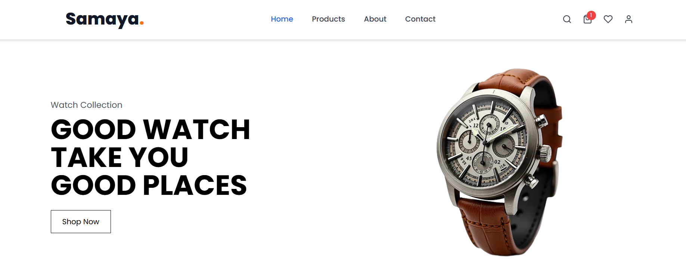 |
| 2.png     | 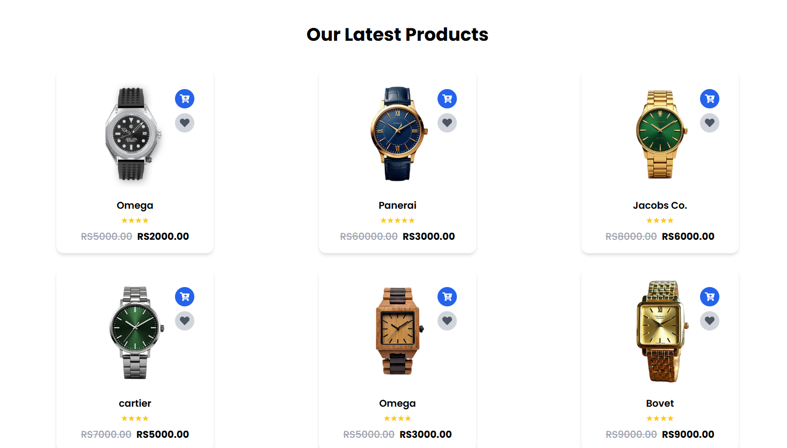 |
| 3.png     |  |
| 4.png     | 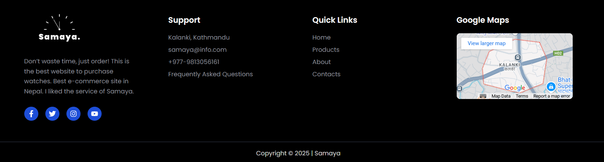 |
| 5.png     | 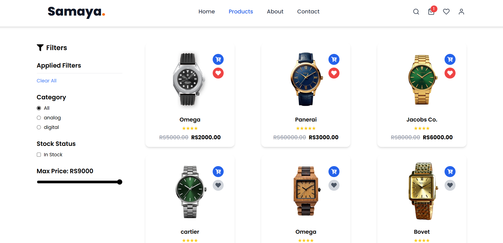 |
| 6.png     | 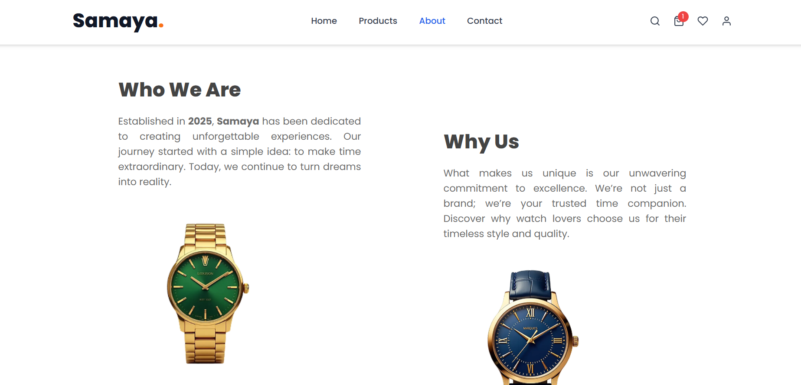 |
| 7.png     | 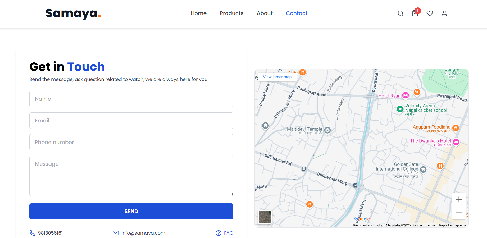 |
| 8.png     | 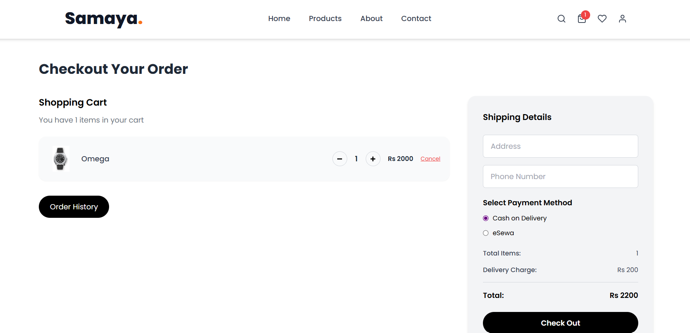 |
| 9.png     | 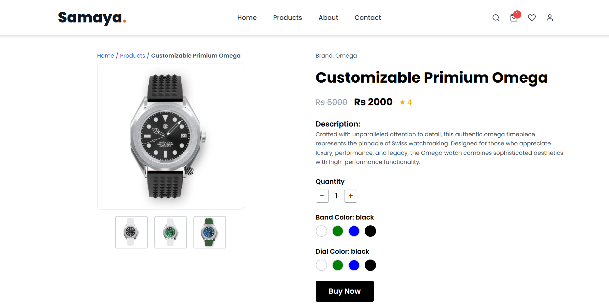 |
| 10.png    | 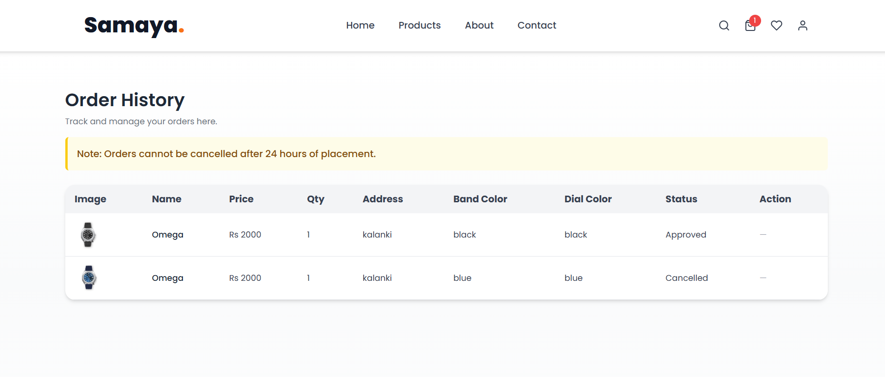 |
| 11.png    | 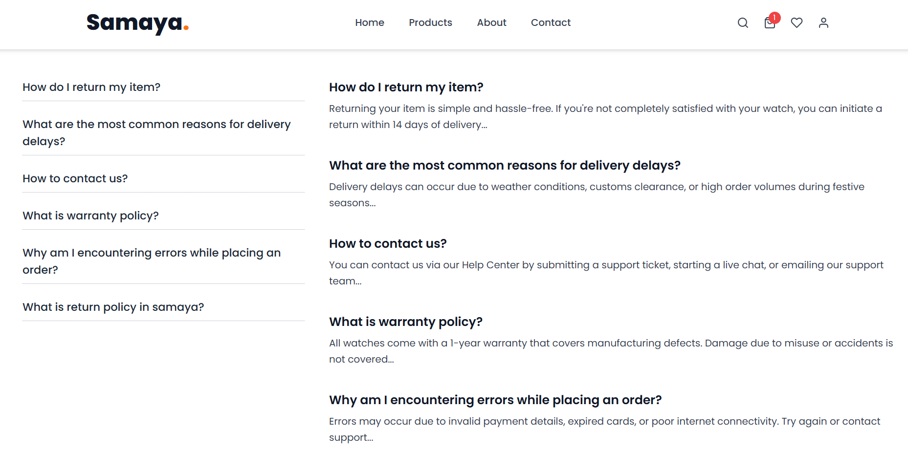 |
| 12.png    | 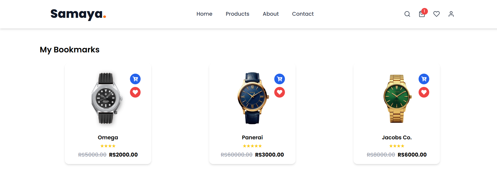 |
| 13.png    | 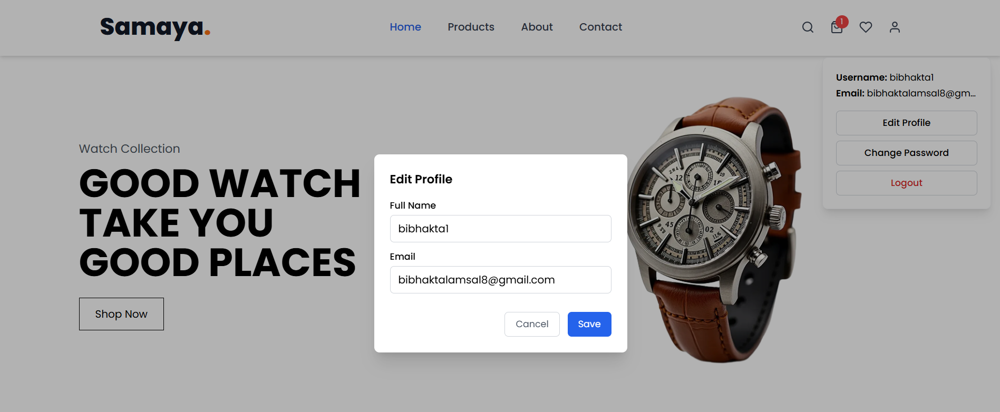 |
| 14.png    | 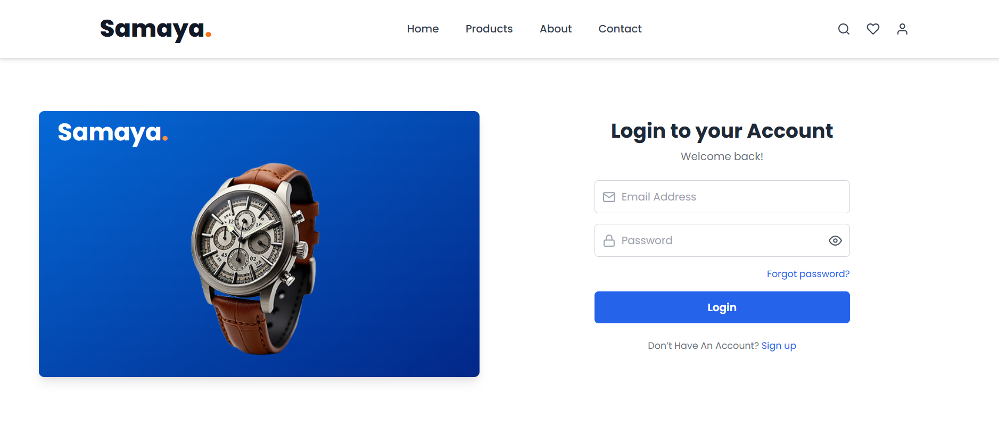 |
| 15.png    | 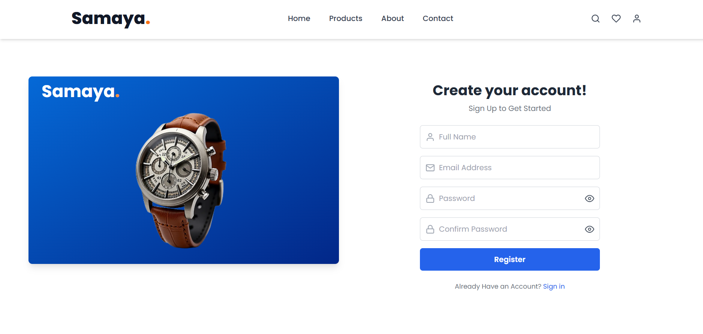 |
| 16.png    | 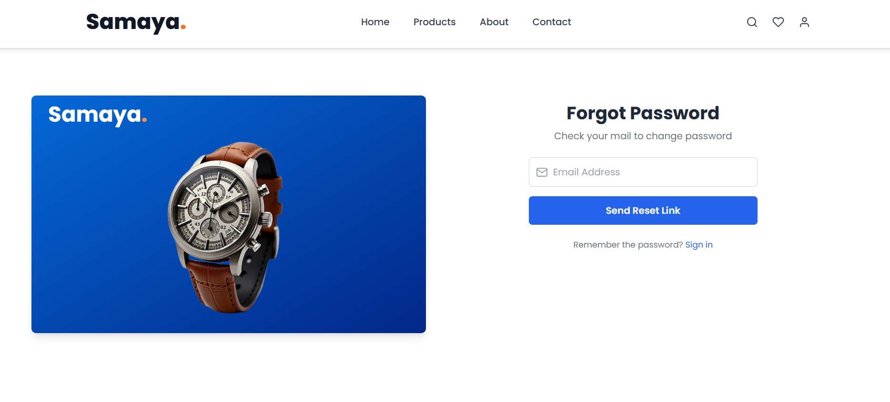 |
| 17.png    | 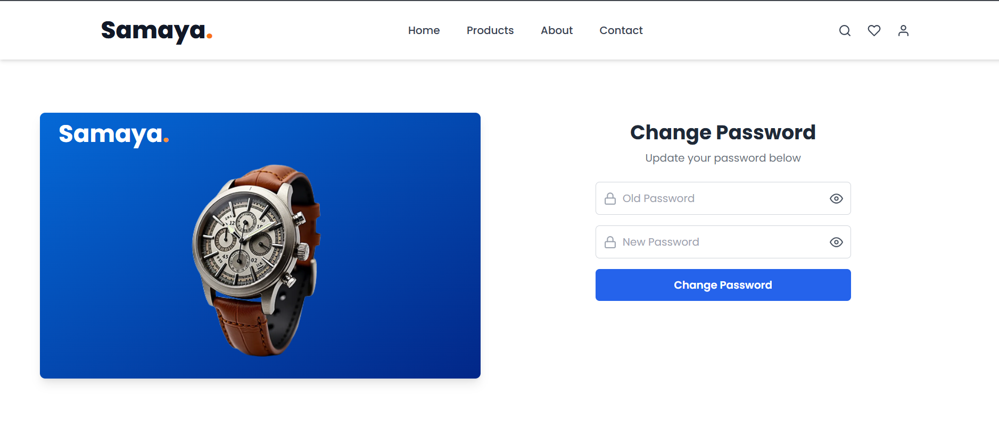 |
| 18.png    | 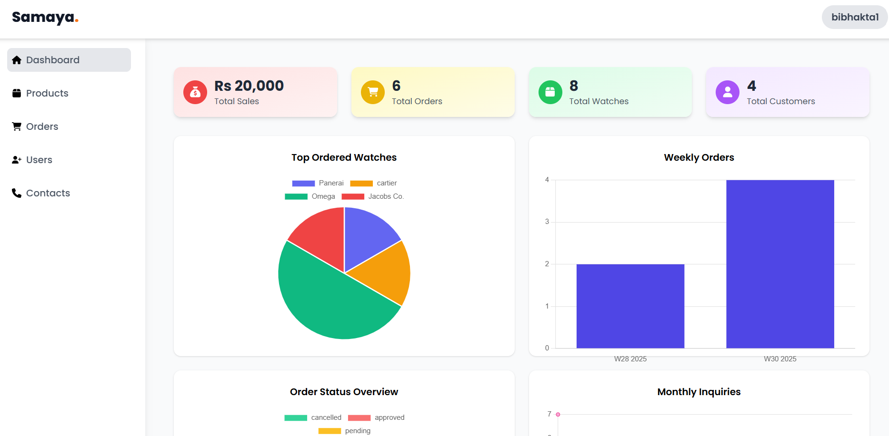 |

---

## 👨‍💻 Author

**Bibhakta Lamsal**  
📧 bibhaktalamsal8@gmail.com
